# Домашнее задание к занятию «Работа с данными (DDL/DML)»
---
### Задание 1
1.1. Поднимите чистый инстанс MySQL версии 8.0+. Можно использовать локальный сервер или контейнер Docker.

1.2. Создайте учётную запись sys_temp.

1.3. Выполните запрос на получение списка пользователей в базе данных. (скриншот)

1.4. Дайте все права для пользователя sys_temp.

1.5. Выполните запрос на получение списка прав для пользователя sys_temp. (скриншот)

1.6. Переподключитесь к базе данных от имени sys_temp.

Для смены типа аутентификации с sha2 используйте запрос:

ALTER USER 'sys_test'@'localhost' IDENTIFIED WITH mysql_native_password BY 'password';
1.6. По ссылке https://downloads.mysql.com/docs/sakila-db.zip скачайте дамп базы данных.

1.7. Восстановите дамп в базу данных.

1.8. При работе в IDE сформируйте ER-диаграмму получившейся базы данных. При работе в командной строке используйте команду для получения всех таблиц базы данных. (скриншот)

Результатом работы должны быть скриншоты обозначенных заданий, а также простыня со всеми запросами.

---

### Задание 2
Составьте таблицу, используя любой текстовый редактор или Excel, в которой должно быть два столбца: в первом должны быть названия таблиц восстановленной базы, во втором названия первичных ключей этих таблиц. Пример: (скриншот/текст)

```
Название таблицы | Название первичного ключа
customer         | customer_id

```

---

---

<h2 align="center">Решение</h2>

---

### Задание 1

1.1 Для выполнения задания был использован локальный сервер MySQL версии 8.0.46, установленный на ОС Windows.

```
mysql --version
# Результат: mysql  Ver 8.0.46 for Win64 on x86_64 (MySQL Community Server - GPL)
```

1.2 Создание учётной записи sys_temp

```
CREATE USER 'sys_temp'@'localhost' IDENTIFIED BY 'password';
CREATE USER 'sys_temp'@'%' IDENTIFIED BY 'password';
```

1.3 Получение списка пользователей

```
SELECT user, host, authentication_string, plugin FROM mysql.user;
```

Результат:

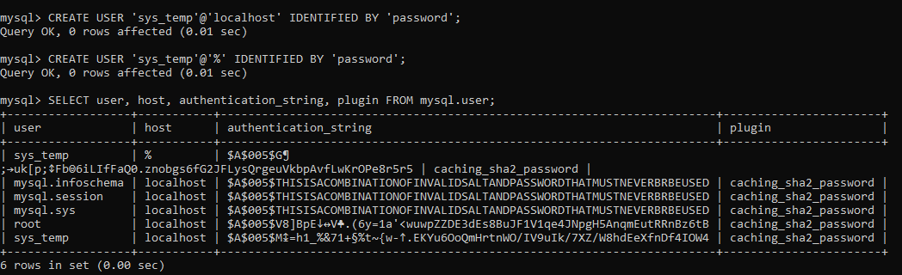

1.4 Выдача всех прав для пользователя sys_temp

```
GRANT ALL PRIVILEGES ON *.* TO 'sys_temp'@'localhost' WITH GRANT OPTION;
GRANT ALL PRIVILEGES ON *.* TO 'sys_temp'@'%' WITH GRANT OPTION;
FLUSH PRIVILEGES;
```

1.5 Получение списка прав для пользователя sys_temp

```
SHOW GRANTS FOR 'sys_temp'@'localhost';
SHOW GRANTS FOR 'sys_temp'@'%';
```

Результат

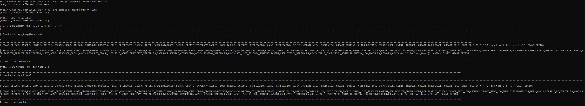

1.6 Смена типа аутентификации и подключение от имени sys_temp

```
ALTER USER 'sys_temp'@'localhost' IDENTIFIED WITH mysql_native_password BY 'password';
ALTER USER 'sys_temp'@'%' IDENTIFIED WITH mysql_native_password BY 'password';
FLUSH PRIVILEGES;
```

Подключение от имени sys_temp:

```
mysql -u sys_temp -ppassword
```

1.7. Скачивание и восстановление дампа Sakila

```
# Создание базы данных
mysql -u sys_temp -ppassword -e "CREATE DATABASE IF NOT EXISTS sakila;"

# Восстановление структуры
mysql -u sys_temp -ppassword sakila < sakila-db/sakila-schema.sql

# Восстановление данных
mysql -u sys_temp -ppassword sakila < sakila-db/sakila-data.sql
```

1.8. Получение списка всех таблиц базы данных

```
USE sakila;
SHOW TABLES;
```

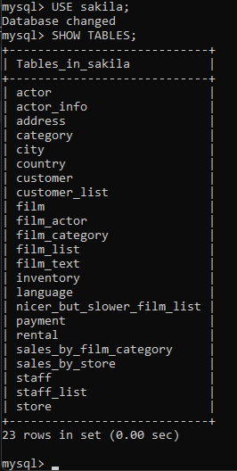

Простыня
<details>
<summary>📜 Список запросов </summary>

```
-- ==============================================
-- 1.2. Создание пользователя sys_temp
-- ==============================================
CREATE USER 'sys_temp'@'localhost' IDENTIFIED BY 'password';
CREATE USER 'sys_temp'@'%' IDENTIFIED BY 'password';

-- ==============================================
-- 1.3. Получение списка пользователей
-- ==============================================
SELECT user, host, authentication_string, plugin 
FROM mysql.user;

-- ==============================================
-- 1.4. Выдача всех прав
-- ==============================================
GRANT ALL PRIVILEGES ON *.* TO 'sys_temp'@'localhost' WITH GRANT OPTION;
GRANT ALL PRIVILEGES ON *.* TO 'sys_temp'@'%' WITH GRANT OPTION;
FLUSH PRIVILEGES;

-- ==============================================
-- 1.5. Получение списка прав
-- ==============================================
SHOW GRANTS FOR 'sys_temp'@'localhost';
SHOW GRANTS FOR 'sys_temp'@'%';

-- ==============================================
-- 1.6. Смена типа аутентификации
-- ==============================================
ALTER USER 'sys_temp'@'localhost' IDENTIFIED WITH mysql_native_password BY 'password';
ALTER USER 'sys_temp'@'%' IDENTIFIED WITH mysql_native_password BY 'password';
FLUSH PRIVILEGES;

-- ==============================================
-- 1.7. Создание базы данных sakila
-- ==============================================
CREATE DATABASE IF NOT EXISTS sakila;

-- Восстановление через командную строку (вне MySQL):
-- mysql -u sys_temp -ppassword sakila < sakila-schema.sql
-- mysql -u sys_temp -ppassword sakila < sakila-data.sql

-- ==============================================
-- 1.8. Получение всех таблиц
-- ==============================================
USE sakila;
SHOW TABLES;

-- Детальная информация о таблицах
SELECT TABLE_NAME, TABLE_TYPE, ENGINE, TABLE_ROWS 
FROM information_schema.TABLES 
WHERE TABLE_SCHEMA = 'sakila'
ORDER BY TABLE_NAME;

-- ==============================================
-- Задание 2. Получение первичных ключей
-- ==============================================
SELECT 
    TABLE_NAME,
    COLUMN_NAME AS PRIMARY_KEY
FROM information_schema.KEY_COLUMN_USAGE
WHERE TABLE_SCHEMA = 'sakila'
    AND CONSTRAINT_NAME = 'PRIMARY'
ORDER BY TABLE_NAME, ORDINAL_POSITION;
```
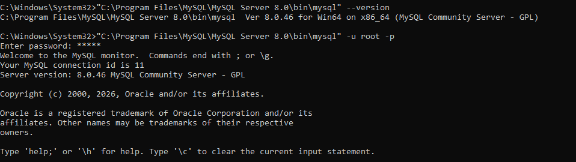

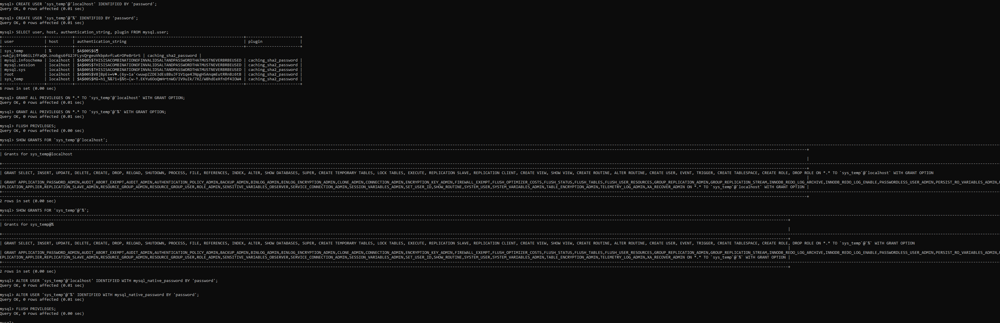

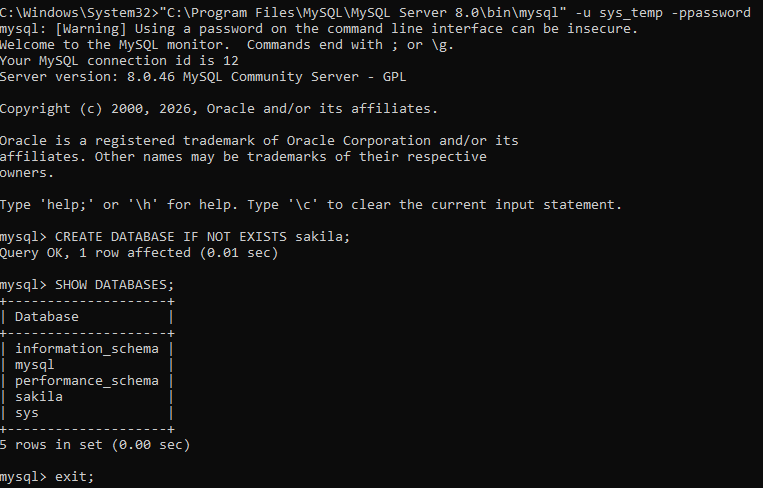

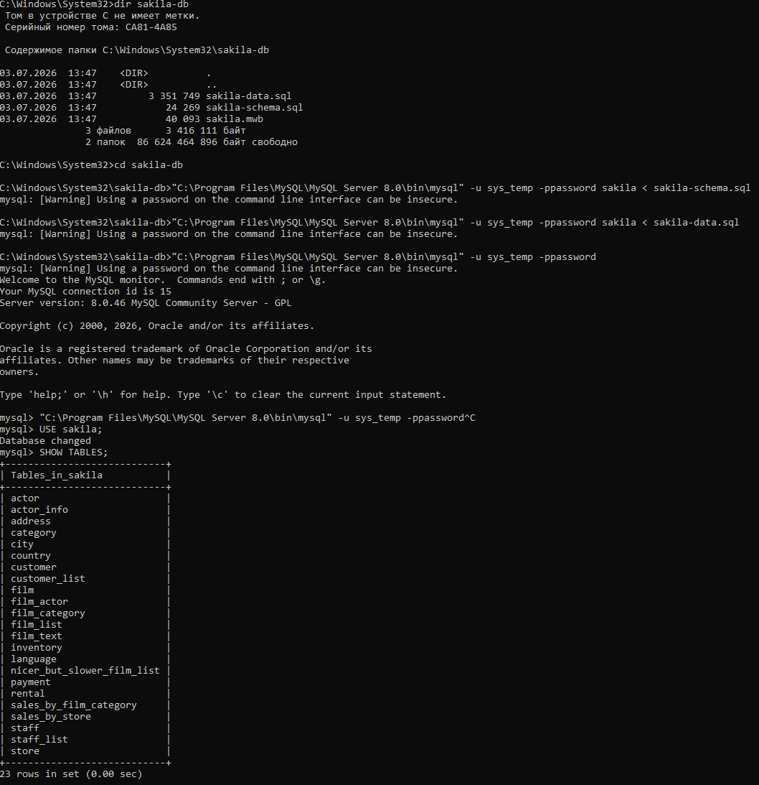

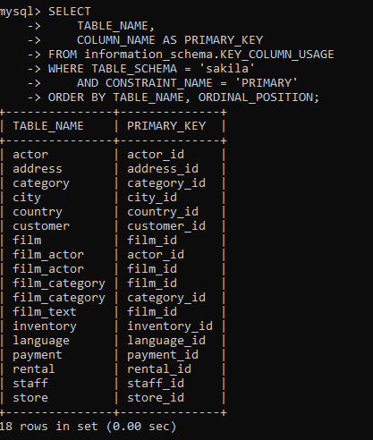

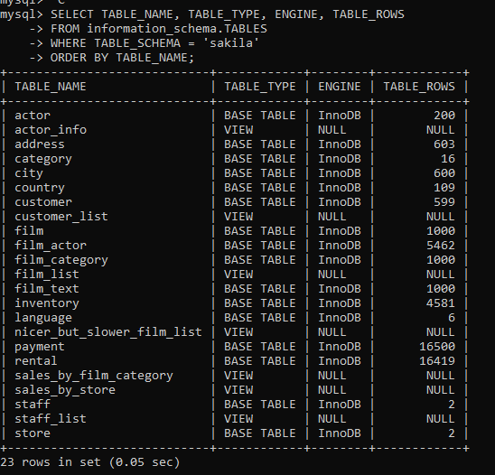

</details>

### Задание 2

Таблица первичных ключей базы данных Sakila

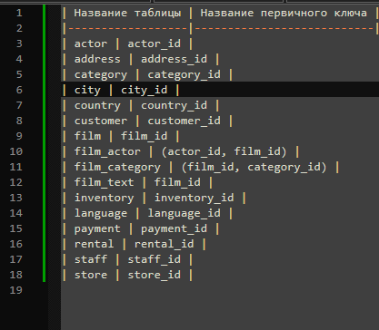

ER-диаграмма
ER-диаграмма базы данных Sakila, созданная с помощью MySQL Workbench:

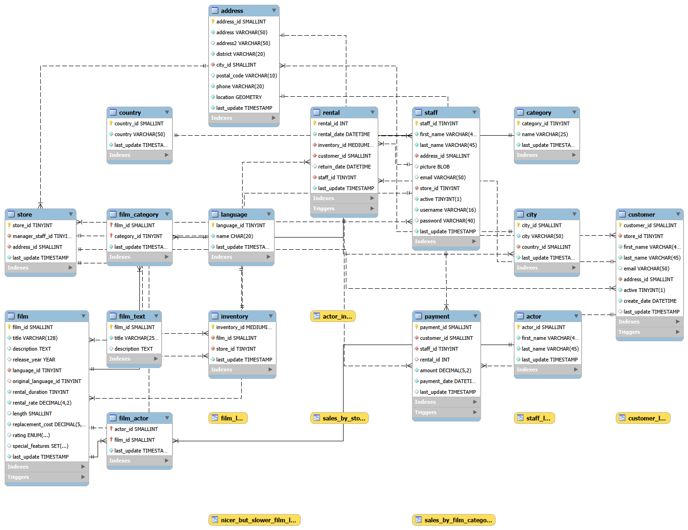

---

<h2 align="center">Вывод</h2>

В ходе выполнения домашнего задания были получены практические навыки:

- Создания и настройки пользователей в MySQL
- Управления правами доступа
- Работы с дампами баз данных
- Визуализации структуры БД с помощью ER-диаграмм
- Определения первичных ключей в реляционной базе данных

---
